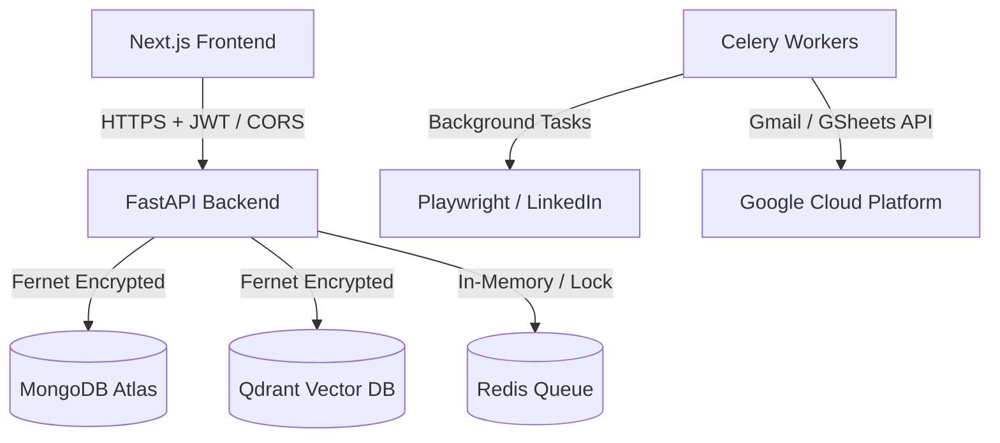

# Security Policy

This document outlines the security architecture, hardening controls, and security best practices for the AI Outreach Platform.

## 1. Security Architecture & Threat Model

The platform is designed to securely automate cold email and LinkedIn outreach with integrated AI capabilities, preventing cross-tenant data leaks and common web/AI threats.

### Key Assets Protected:
- **OAuth & API Credentials**: Gmail refresh tokens, Apollo/Hunter API keys.
- **Session State**: Playwright/LinkedIn browser cookies.
- **Tenant Data**: Leads list, custom templates, campaign performance analytics.

---

## 2. Implemented Security Controls

### 2.1 Identity & Access Security
- **Authentication**: JWT Bearer tokens with strict expiration and validation.
- **Access Control (RBAC)**: Fine-grained tenant isolation checking ownership (`user_id`) on all CRUD queries for campaigns, leads, integrations, and tasks.
- **Rate Limiting**: Thread-safe per-IP request throttling via `RateLimitMiddleware` to prevent brute-force attacks and API abuse.

### 2.2 Data Protection (Cryptography)
- **Encryption at Rest**: Symmetric encryption (`cryptography.fernet`) with keys derived from `COOKIE_ENCRYPTION_KEY` and `JWT_SECRET`. Sensitive fields (LinkedIn cookies, Gmail tokens, API keys) are encrypted before insertion into MongoDB.
- **Password Protection**: Salted password hashing using `bcrypt` (cost factor 12).
- **Transport Security**: HSTS, HTTP-only, and SameSite headers enforced.

### 2.3 Injection & SSTI Prevention
- **NoSQL Injection**: Input filters recursively strip keys starting with `$` to block MongoDB query operator injections (implemented in `sanitize_nosql`).
- **File Upload Protection**: Whitelisted extension validation (`.csv`, `.xlsx`, `.pdf`, etc.) and unique identifier renaming (`file_id`) to block arbitrary shell uploads and Stored XSS.
- **SSTI/Prompt Injection Protection**: LLM inputs use strict regex string interpolation and token bounds, with all user message lengths capped at 4000 characters to prevent LPDoS (Large Prompt DoS).

### 2.4 API Hardening & Middlewares
- **CORS Hardening**: Strict origin whitelist checks.
- **Security Headers**: Enforced via `SecurityHeadersMiddleware`:
  - `Content-Security-Policy`: `default-src 'self'; frame-ancestors 'none';`
  - `X-Frame-Options`: `DENY`
  - `X-Content-Type-Options`: `nosniff`
  - `Referrer-Policy`: `strict-origin-when-cross-origin`
  - `Strict-Transport-Security`: `max-age=31536000; includeSubDomains`
- **Error Masking**: Production errors mask raw traceback/exception leaks.

---

## 3. Production Security Hardening Checklist

When deploying to production (e.g. Azure VM, Docker compose), ensure the following steps are verified:

- [ ] **Secrets Rotation**: Ensure `JWT_SECRET` and `COOKIE_ENCRYPTION_KEY` are rotated and do not use development defaults.
- [ ] **Enable HSTS & HTTPS**: Set `DEBUG=false` in `.env` to enforce HTTPS redirect and HSTS headers.
- [ ] **Restrict MongoDB Network**: Configure MongoDB Atlas IP access lists to only accept connections from backend server IPs.
- [ ] **Docker Isolation**: Run Docker containers as non-root users (least privilege) and limit container resources (CPU, Memory).
- [ ] **Firewall rules**: Close all SSH ports except for whitelist admin IPs, and configure Fail2Ban on the Azure VM.
- [ ] **Enable Playwright Headless**: Set `LINKEDIN_HEADLESS=true` in production to prevent visual frame rendering overhead.
- [ ] **Scan Dependency updates**: Run periodic security audits (`pip audit`, `npm audit`) to address dependency vulnerabilities.
